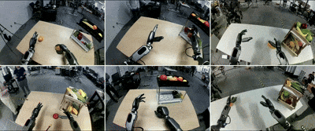
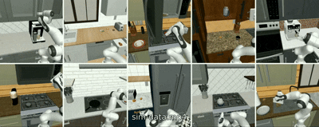
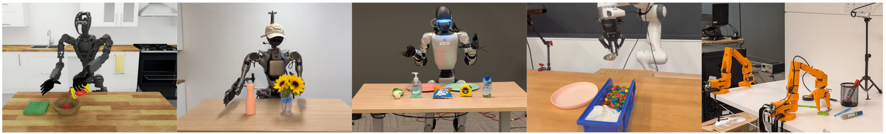
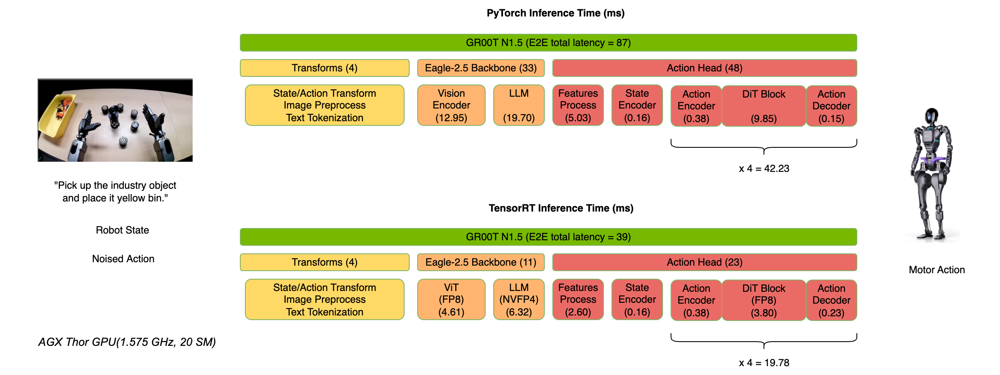

<div align="center">


  
  
  <!-- --- -->
  
  <p style="font-size: 1.2em;">
    <a href="https://developer.nvidia.com/isaac/gr00t"><strong>Website</strong></a> | 
    <a href="https://huggingface.co/nvidia/GR00T-N1.5-3B"><strong>Model</strong></a> |
    <a href="https://huggingface.co/datasets/nvidia/PhysicalAI-Robotics-GR00T-X-Embodiment-Sim"><strong>Dataset</strong></a> |
    <a href="https://arxiv.org/abs/2503.14734"><strong>Paper</strong></a> |
    <a href="reference_architecture/reference_architecture.md"><strong>Reference Architecture</strong></a>
  </p>
</div>

[](https://github.com/NVIDIA/Isaac-GR00T/actions/workflows/main.yml)
[](https://github.com/psf/black)
[](https://pycqa.github.io/isort/)
[](https://star-history.com/#NVIDIA/Isaac-GR00T)
[](https://github.com/NVIDIA/Isaac-GR00T/issues)

## NVIDIA Isaac GR00T

<div align="center">

</div>

<div>

---
> We now provide **finetuning scripts** and release **HuggingFace checkpoints**, along with results on **widely used academic simulation benchmarks**, making it easier to compare with prior work, ensure reproducibility, and build on a shared foundation for future research.
>
> For more, please refer to the [benchmark results folder](./examples).
---

</div>

> We just released GR00T N1.5, an updated version of GR00T N1 with improved performance and new features. Check out the release blog post (https://research.nvidia.com/labs/gear/gr00t-n1_5/) for more details.

> To use the older version, N1, please checkout the [n1-release](https://github.com/NVIDIA/Isaac-GR00T/tree/n1-release) release branch.

NVIDIA Isaac GR00T N1.5 is an open foundation model for generalized humanoid robot reasoning and skills. This cross-embodiment model takes multimodal input, including language and images, to perform manipulation tasks in diverse environments.

GR00T N1.5 is trained on an expansive humanoid dataset, consisting of real captured data, synthetic data generated using the components of NVIDIA Isaac GR00T Blueprint ([examples of neural-generated trajectories](./media/videos)), and internet-scale video data. It is adaptable through post-training for specific embodiments, tasks and environments.

<div align="center">


</div>

The neural network architecture of GR00T N1.5 is a combination of vision-language foundation model and diffusion transformer head that denoises continuous actions. Here is a schematic diagram of the architecture:

<div align="center">

</div>

Here is the general procedure to use GR00T N1.5:

1. Assume the user has already collected a dataset of robot demonstrations in the form of (video, state, action) triplets. 
2. The user will first convert the demonstration data into the LeRobot compatible data schema (more info in [`getting_started/LeRobot_compatible_data_schema.md`](getting_started/LeRobot_compatible_data_schema.md)), which is compatible with the upstream [Huggingface LeRobot](https://github.com/huggingface/lerobot).
3. Our repo provides examples of different configurations for training with different robot embodiments.
4. Our repo provides convenient scripts for finetuning the pre-trained GR00T N1.5 model on user's data, and running inference.
5. The user will connect the `Gr00tPolicy` to the robot controller to execute actions on their target hardware.

## What's New in GR00T N1.5

GR00T N1.5 represents a significant upgrade over GR00T N1, with improvements in both model architecture and data leading to better performance in many aspects.

### Model and Data Improvements

- **Frozen VLM**: The vision-language model remains frozen during both pretraining and finetuning, preserving language understanding and improving generalization
- **Enhanced VLM Grounding**: Updated to Eagle 2.5 with improved grounding capabilities and physical understanding, achieving 40.4 IoU on GR-1 grounding tasks (vs 35.5 for Qwen2.5VL).
- **Simplified Adapter**: Streamlined MLP connection between vision encoder and LLM with added layer normalization.
- **FLARE Integration**: Added Future Latent Representation Alignment ([FLARE](https://research.nvidia.com/labs/gear/flare)) objective alongside flow matching loss, enabling effective learning from human ego videos
- **DreamGen Integration**: Incorporated synthetic neural trajectories generated via [DreamGen](https://research.nvidia.com/labs/gear/dreamgen) to enable generalization to novel behaviors and tasks beyond teleoperation data

### Performance Improvements

- **Language Following**: Significantly improved language command following versus N1 - 93.3% vs 46.6% on GR-1 manipulation tasks.
- **Data Efficiency**: Better performance in low-data regimes (0-shot and few-shot scenarios)
- **Better Novel Object Generalization**
- **New Embodiment Heads**: Added support for single arm robots with end-effector (EEF) control space via `EmbodimentTag.OXE_DROID` head, and humanoid robots with grippers via `EmbodimentTag.AGIBOT_GENIE1` head, expanding beyond joint space control to enable broader robot compatibility

These improvements make GR00T N1.5 particularly effective for applications requiring strong language understanding, few-shot adaptation, and generalization to novel objects and environments.
See our GR00T N1.5 [tech blog](https://research.nvidia.com/labs/gear/gr00t-n1_5) for more details on the model and experimental results.

## Target Audience

GR00T N1.5 is intended for researchers and professionals in humanoid robotics. This repository provides tools to:

- Leverage a pre-trained foundation model for robot control
- Fine-tune on small, custom datasets
- Adapt the model to specific robotics tasks with minimal data
- Deploy the model for inference

The focus is on enabling customization of robot behaviors through finetuning.

## Prerequisites

- We have tested the code on Ubuntu 20.04 and 22.04, GPU: H100, L40, RTX 4090, and A6000 for finetuning and Python==3.10, CUDA version 12.4.
- Additionally, successful finetuning and inference have been verified on Ubuntu 22.04 with GPU: RTX 3090 Ti, Python==3.10, CUDA version 11.8.
- For inference, we have tested on Ubuntu 20.04 and 22.04, GPU: RTX 3090, RTX 3090 Ti, RTX 4090, and A6000.
- If you haven't installed CUDA (version 12.4 recommended, but 11.8 also confirmed working), please follow the instructions [here](https://docs.nvidia.com/cuda/cuda-installation-guide-linux/) to install it.
- If you haven't installed tensorrt, please follow the instructions [here](https://docs.nvidia.com/deeplearning/tensorrt/latest/installing-tensorrt/installing.html#) to install it.
- Please make sure you have the following dependencies installed in your system: `ffmpeg`, `libsm6`, `libxext6`

## Installation Guide

Clone the repo:

```sh
git clone https://github.com/NVIDIA/Isaac-GR00T
cd Isaac-GR00T
```

Create a new conda environment and install the dependencies. We recommend Python 3.10:

> Note: CUDA 12.4 is recommended and officially tested. However, CUDA 11.8 has also been verified to work.
> In such cases, make sure to install a compatible version of `flash-attn` manually (e.g., `flash-attn==2.8.2` was confirmed working with CUDA 11.8).

```sh
conda create -n gr00t python=3.10
conda activate gr00t
pip install --upgrade setuptools
pip install -e .[base]
pip install --no-build-isolation flash-attn==2.7.1.post4 
```

## Getting started with this repo

We provide accessible Jupyter notebooks and detailed documentation in the [`./getting_started`](./getting_started) folder. Utility scripts can be found in the [`./scripts`](./scripts) folder. Additionally, a comprehensive tutorial for finetuning the model on the SO-101 robot is available on [HuggingFace](https://huggingface.co/blog/nvidia/gr00t-n1-5-so101-tuning).

## 0. Quick Start

Download the model checkpoint and run the inference service.
```bash
python scripts/inference_service.py --model-path nvidia/GR00T-N1.5-3B --server
```

On a different terminal, run the client mode to send requests to the server. This will send a random observation to the server and get an action back.
```bash
python scripts/inference_service.py  --client
```

## 1. Data Format & Loading

- To load and process the data, we use [Huggingface LeRobot data](https://github.com/huggingface/lerobot), but with a more detailed modality and annotation schema (we call it "LeRobot compatible data schema").
- An example of LeRobot dataset is stored here: `./demo_data/robot_sim.PickNPlace`. (with additional [`modality.json`](./demo_data/robot_sim.PickNPlace/meta/modality.json) file)
- Detailed explanation of the dataset format is available in [`getting_started/LeRobot_compatible_data_schema.md`](getting_started/LeRobot_compatible_data_schema.md)
- We support multiple embodiments with the [`EmbodimentTag`](getting_started/4_deeper_understanding.md#embodiment-action-head-fine-tuning) system.
- Once your data is organized in this format, you can load the data using `LeRobotSingleDataset` class.

```python
from gr00t.data.dataset import LeRobotSingleDataset
from gr00t.data.embodiment_tags import EmbodimentTag
from gr00t.data.dataset import ModalityConfig
from gr00t.experiment.data_config import DATA_CONFIG_MAP

# get the data config
data_config = DATA_CONFIG_MAP["fourier_gr1_arms_only"]

# get the modality configs and transforms
modality_config = data_config.modality_config()
transforms = data_config.transform()

# This is a LeRobotSingleDataset object that loads the data from the given dataset path.
dataset = LeRobotSingleDataset(
    dataset_path="demo_data/robot_sim.PickNPlace",
    modality_configs=modality_config,
    transforms=None,  # we can choose to not apply any transforms
    embodiment_tag=EmbodimentTag.GR1, # the embodiment to use
)

# This is an example of how to access the data.
dataset[5]
```

- [`getting_started/0_load_dataset.ipynb`](getting_started/0_load_dataset.ipynb) is an interactive tutorial on how to load the data and process it to interface with the GR00T N1.5 model.
- [`scripts/load_dataset.py`](scripts/load_dataset.py) is an executable script with the same content as the notebook.

Try run the script to load the dataset
```bash
python scripts/load_dataset.py --dataset-path ./demo_data/robot_sim.PickNPlace
```

## 2. Inference

* The GR00T N1.5 model is hosted on [Huggingface](https://huggingface.co/nvidia/GR00T-N1.5-3B)
* Example cross embodiment dataset is available at [demo_data/robot_sim.PickNPlace](./demo_data/robot_sim.PickNPlace)

### 2.1 Inference with PyTorch

```python
from gr00t.model.policy import Gr00tPolicy
from gr00t.data.embodiment_tags import EmbodimentTag

# 1. Load the modality config and transforms, or use above
modality_config = ComposedModalityConfig(...)
transforms = ComposedModalityTransform(...)

# 2. Load the dataset
dataset = LeRobotSingleDataset(.....<Same as above>....)

# 3. Load pre-trained model
policy = Gr00tPolicy(
    model_path="nvidia/GR00T-N1.5-3B",
    modality_config=modality_config,
    modality_transform=transforms,
    embodiment_tag=EmbodimentTag.GR1,
    device="cuda"
)

# 4. Run inference
action_chunk = policy.get_action(dataset[0])
```

- [`getting_started/1_gr00t_inference.ipynb`](getting_started/1_gr00t_inference.ipynb) is an interactive Jupyter notebook tutorial to build an inference pipeline.

User can also run the inference service using the provided script. The inference service can run in either server mode or client mode.

```bash
# server
python scripts/inference_service.py --model-path nvidia/GR00T-N1.5-3B --server

# client
python scripts/inference_service.py  --client
```

### 2.2 Inference with Python TensorRT (Optional)

To inference with ONNX and TensorRT, please refer to [`deployment_scripts/README.md`](deployment_scripts/README.md).

## 3. Fine-Tuning

Users can run the finetuning script below to finetune the model with the example dataset. A tutorial is available in [`getting_started/2_finetuning.ipynb`](getting_started/2_finetuning.ipynb).

Then run the finetuning script:
```bash
# first run --help to see the available arguments
python scripts/gr00t_finetune.py --help

# then run the script
python scripts/gr00t_finetune.py --dataset-path ./demo_data/robot_sim.PickNPlace --num-gpus 1
```

**Note**: If you are finetuning on a 4090, you need to pass the `--no-tune_diffusion_model` flag when running `gr00t_finetune.py` to avoid CUDA out of memory.

The recommended finetuning configuration is to boost your batch size to the max, and train for 20k steps.

*Hardware Performance Considerations*
- **Finetuning Performance**: We used 1 H100 node or L40 node for optimal finetuning. Other hardware configurations (e.g. A6000, RTX 4090) will also work but may take longer to converge. The exact batch size is dependent on the hardware, and on which component of the model is being tuned.
- **LoRA finetuning**: We used 2 A6000 GPUs or 2 RTX 4090 GPUs for LoRA finetuning. Users can try out different configurations for effective finetuning.
- **Inference Performance**: For real-time inference, most modern GPUs perform similarly when processing a single sample. Our benchmarks show minimal difference between L40 and RTX 4090 for inference speed.

For new embodiment finetuning, checkout our notebook in [`getting_started/3_0_new_embodiment_finetuning.md`](getting_started/3_0_new_embodiment_finetuning.md).

### Choosing the Right Embodiment Head

<div align="center">

</div>

GR00T N1.5 provides three pretrained embodiment heads optimized for different robot configurations:

- **`EmbodimentTag.GR1`**: Designed for humanoid robots with dexterous hands using absolute joint space control
- **`EmbodimentTag.OXE_DROID`**: Optimized for single arm robots using delta end-effector (EEF) control  
- **`EmbodimentTag.AGIBOT_GENIE1`**: Built for humanoid robots with grippers using absolute joint space control
- **`EmbodimentTag.NEW_EMBODIMENT`**: (Non-pretrained) New embodiment head for finetuning on new robot embodiments

Select the embodiment head that best matches your robot's configuration for optimal finetuning performance. For detailed information on the observation and action spaces, see [`EmbodimentTag`](getting_started/4_deeper_understanding.md#embodiment-action-head-fine-tuning).


### Sim Env: [robocasa-gr1-tabletop-tasks](https://github.com/robocasa/robocasa-gr1-tabletop-tasks)

Sample dataset for finetuning can be downloaed from our huggingface [here](https://huggingface.co/datasets/nvidia/PhysicalAI-Robotics-GR00T-X-Embodiment-Sim)

For Simulation Evaluation, please refer to [robocasa-gr1-tabletop-tasks](https://github.com/robocasa/robocasa-gr1-tabletop-tasks)


## 4. Evaluation

To conduct an offline evaluation of the model, we provide a script that evaluates the model on a dataset and plots it out. Quick try: `python scripts/eval_policy.py --plot --model_path nvidia/GR00T-N1.5-3B`

Or you can run the newly trained model in client-server mode.

Run the newly trained model
```bash
python scripts/inference_service.py --server \
    --model-path <MODEL_PATH> \
    --embodiment-tag new_embodiment
    --data-config <DATA_CONFIG>
```

Run the offline evaluation script
```bash
python scripts/eval_policy.py --plot \
    --dataset-path <DATASET_PATH> \
    --embodiment-tag new_embodiment \
    --data-config <DATA_CONFIG>
```

You will then see a plot of Ground Truth vs Predicted actions, along with unnormed MSE of the actions. This would give you an indication if the policy is performing well on the dataset.

## Jetson Deployment

A detailed guide for deploying GR00T N1.5 on Jetson is available in [`deployment_scripts/README.md`](deployment_scripts/README.md).

Here's comparison of E2E performance between PyTorch and TensorRT on Thor

<div align="center">

</div>

Model latency measured by `trtexec` with batch_size=1.     
| Model Name                                     |Thor benchmark perf (ms) (FP16) |Thor benchmark perf (ms) (FP8+FP4) |
|:----------------------------------------------:|:------------------------------:|:---------------------------------:|
| Action_Head - process_backbone_output          | 2.35                           | /                                 |
| Action_Head - state_encoder                    | 0.04                           | /                                 |
| Action_Head - action_encoder                   | 0.10                           | /                                 |
| Action_Head - DiT                              | 5.46                           | 3.41                              |
| Action_Head - action_decoder                   | 0.03                           | /                                 |
| VLM - ViT                                      | 5.21                           | 4.10                              |
| VLM - LLM                                      | 8.53                           | 5.81                              |
      
**Note**: The module latency (e.g., DiT Block) in pipeline is slightly longer than the model latency in benchmark table above because the module (e.g., Action_Head - DiT) latency not only includes the model latency in table above but also accounts for the overhead of data transfer from PyTorch to TRT and returning from TRT to PyTorch.

# FAQ

*Does it work on CUDA ARM Linux?*
- Yes, visit [jetson-containers](https://github.com/dusty-nv/jetson-containers/tree/master/packages/robots/Isaac-GR00T). 

*I have my own data, what should I do next for finetuning?*
- This repo assumes that your data is already organized according to the LeRobot format. 


*What is Modality Config? Embodiment Tag? and Transform Config?*
- Embodiment Tag: Defines the robot embodiment used, non-pretrained embodiment tags are all considered as `new_embodiment`.
- Modality Config: Defines the modalities used in the dataset (e.g. video, state, action)
- Transform Config: Defines the Data Transforms applied to the data during dataloading.
- For more details, see [`getting_started/4_deeper_understanding.md`](getting_started/4_deeper_understanding.md)

*What is the inference speed for Gr00tPolicy?*

Below are benchmark results based on a single H100 GPU. Performance will be slightly slower on consumer GPUs like RTX 4090 for inference (single sample processing):

| Module | Inference Speed |
|----------|------------------|
| VLM Backbone | 23.18 ms |
| Action Head with 4 diffusion steps | 4 x 6.18 ms = 24.7 ms |
| Full Model | 47.88 ms |

We noticed that 4 denoising steps are sufficient during inference.

*How to train with multiple datasets?*

You can train with multiple datasets by providing a list of dataset paths to the `dataset_path` argument.

```bash
python scripts/gr00t_finetune.py --dataset-path <DATASET1> <DATASET2> --num-gpus 1
```

By default, the `gr00t_finetune.py` imposes equal weights to all datasets, with `balance_dataset_weights` and `balance_trajectory_weights` set to `True`. For more details, see the `LeRobotMixtureDataset` class definition in `gr00t/data/dataset.py`. Users can also use the `LeRobotMixtureDataset` class directly to train with multiple datasets with different embodiments, transforms, and sampling weights.

*Is LoRA finetuning supported?*

Yes, you can use LoRA finetuning to finetune the model. This can be enabled by indicating `--lora_rank 64  --lora_alpha 128` in the finetuning script. However, we recommend using the full model finetuning for better performance.

*How to use GR00T on Blackwell Architecture?*

The SO-101 demo has been tested on an RTX Pro 6000 Workstation Edition GPU.

 These were the steps necessary for testing. In short, what's different is installing a particular version of PyTorch, then building Flash Attention from source, then using it. These instructions may need to be adapted for your particular machine.

1. Clone the GR00T repo.
2. Create and activate a GR00T conda environment as normal.
3. Install a stable version of PyTorch according to your CUDA version. Find the correct version using the helper website [here](https://pytorch.org/get-started/locally/). Example for CUDA 12.8:
`pip3 install torch torchvision`
4. To confirm compatability between torch and CUDA versions:
`python -c "import torch; print(torch.version.cuda); print(torch.cuda.get_device_capability())"`
5. Clone the `flash_attention` repo: 
`git clone https://github.com/Dao-AILab/flash-attention.git`
6. Checkout a recent version: `git checkout v2.8.3`
7. Set the following environment variable in your terminal:
`export TORCH_CUDA_ARCH_LIST="sm_120"`
8. `cd flash-attention`
9. Install flash-attn by running the following inside the flash-attention repo: `pip install .`
10. Continue to post-training.

**How to use `torchcodec` for video decoding?**

Ensure you have the correct version of `torchcodec` installed. This also requires the correct version of `ffmpeg` installed. For more info, check out the [torchcodec documentation](https://github.com/pytorch/torchcodec).

we tested it with `ffmpeg` version 7.0.1
```bash
sudo apt-get update
sudo apt-get install -y software-properties-common
sudo add-apt-repository -y ppa:ubuntuhandbook1/ffmpeg7
sudo apt-get update
sudo apt-get install -y ffmpeg
ffmpeg -version
```

If you encounter `ValueError: No valid stream found in input file.`, this requires you to use the correct version of `ffmpeg` and `torchcodec`.


# Contributing

For more details, see [CONTRIBUTING.md](CONTRIBUTING.md)


## License 

```
# SPDX-FileCopyrightText: Copyright (c) 2025 NVIDIA CORPORATION & AFFILIATES. All rights reserved.
# SPDX-License-Identifier: Apache-2.0
#
# Licensed under the Apache License, Version 2.0 (the "License");
# you may not use this file except in compliance with the License.
# You may obtain a copy of the License at
#
# http://www.apache.org/licenses/LICENSE-2.0
#
# Unless required by applicable law or agreed to in writing, software
# distributed under the License is distributed on an "AS IS" BASIS,
# WITHOUT WARRANTIES OR CONDITIONS OF ANY KIND, either express or implied.
# See the License for the specific language governing permissions and
# limitations under the License.
```


## Citation

Nvidia Research. [website](https://research.nvidia.com/labs/lpr/publication/gr00tn1_2025/)
```bibtex
@inproceedings{gr00tn1_2025,
  archivePrefix = {arxiv},
  eprint     = {2503.14734},
  title      = {{GR00T} {N1}: An Open Foundation Model for Generalist Humanoid Robots},
  author     = {NVIDIA and Johan Bjorck andFernando Castañeda, Nikita Cherniadev and Xingye Da and Runyu Ding and Linxi "Jim" Fan and Yu Fang and Dieter Fox and Fengyuan Hu and Spencer Huang and Joel Jang and Zhenyu Jiang and Jan Kautz and Kaushil Kundalia and Lawrence Lao and Zhiqi Li and Zongyu Lin and Kevin Lin and Guilin Liu and Edith Llontop and Loic Magne and Ajay Mandlekar and Avnish Narayan and Soroush Nasiriany and Scott Reed and You Liang Tan and Guanzhi Wang and Zu Wang and Jing Wang and Qi Wang and Jiannan Xiang and Yuqi Xie and Yinzhen Xu and Zhenjia Xu and Seonghyeon Ye and Zhiding Yu and Ao Zhang and Hao Zhang and Yizhou Zhao and Ruijie Zheng and Yuke Zhu},
  month      = {March},
  year       = {2025},
  booktitle  = {ArXiv Preprint},
}
```
