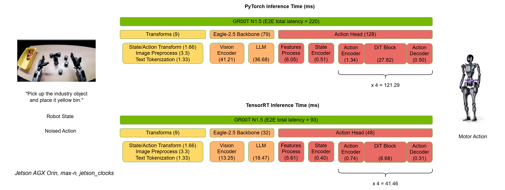

## Jetson Deployment

### Prerequisites

- AGX Orin installed with Jetpack 6.2

### 1. Installation Guide

Clone the repo:

```sh
git clone https://github.com/NVIDIA/Isaac-GR00T
cd Isaac-GR00T
```

### Install Isaac-GR00T directly

Run below setup script to install the dependencies for Jetson Orin:

```sh
bash deployment_scripts/setup_env.sh
```

### Deploy Isaac-GR00T with Container

#### Build Container

To build a container for Isaac-GR00T:

Build container for Jetson Orin:
```sh
docker build -t isaac-gr00t-n1.5:l4t-jp6.2 -f orin.Dockerfile .
```

#### Run Container

To run the container:

Run container for Orin:
```sh
docker run --rm -it --runtime nvidia -v "$PWD":/workspace -w /workspace isaac-gr00t-n1.5:l4t-jp6.2
```

### 2. Inference

* The GR00T N1.5 model is hosted on [Huggingface](https://huggingface.co/nvidia/GR00T-N1.5-3B)
* Example cross embodiment dataset is available at [demo_data/robot_sim.PickNPlace](./demo_data/robot_sim.PickNPlace)
* This project supports to run the inference with PyTorch or Python TensorRT as instructions below
* Add Isaac-GR00T to PYTHONPATH: `export PYTHONPATH=/path/to/Isaac-GR00T:$PYTHONPATH`

### 2.1 Inference with PyTorch

```bash
python deployment_scripts/gr00t_inference.py --inference-mode=pytorch
```

### 2.2 Inference with Python TensorRT

Export ONNX model
```bash
python deployment_scripts/export_onnx.py --dit-dtype fp16 --vit-dtype fp16 --llm-dtype fp16
```
Build TensorRT engine
```bash
VIT_DTYPE=fp16 LLM_DTYPE=fp16 DIT_DTYPE=fp16 bash deployment_scripts/build_engine.sh
```
Inference with TensorRT
```bash
python deployment_scripts/gr00t_inference.py --dit-dtype fp16 --vit-dtype fp16 --llm-dtype fp16 --inference-mode=tensorrt
```

## 3. Performance
### 3.1 Pipline Performance
Here's comparison of E2E performance between PyTorch and TensorRT on Orin:

<div align="center">

</div>

### 3.2 Models Performance
Model latency measured by `trtexec` with batch_size=1.     
| Model Name                                     |Orin benchmark perf (ms)  |Precision|
|:----------------------------------------------:|:------------------------:|:-------:|
| Action_Head - process_backbone_output          | 5.17                     |FP16     |
| Action_Head - state_encoder                    | 0.05                     |FP16     |
| Action_Head - action_encoder                   | 0.20                     |FP16     |
| Action_Head - DiT                              | 7.77                     |FP16     |
| Action_Head - action_decoder                   | 0.04                     |FP16     |
| VLM - ViT                                      |11.96                     |FP16     |
| VLM - LLM                                      |17.25                     |FP16     |  
      
**Note**: The module latency (e.g., DiT Block) in pipeline is slightly longer than the model latency in benchmark table above because the module (e.g., Action_Head - DiT) latency not only includes the model latency in table above but also accounts for the overhead of data transfer from PyTorch to TRT and returning from TRT to PyTorch.
