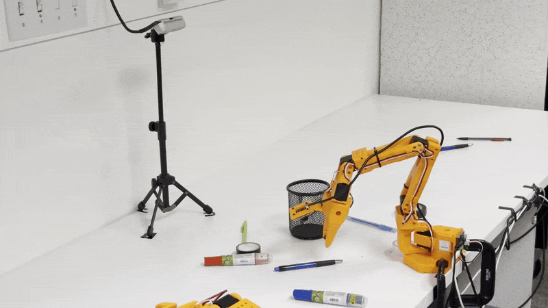
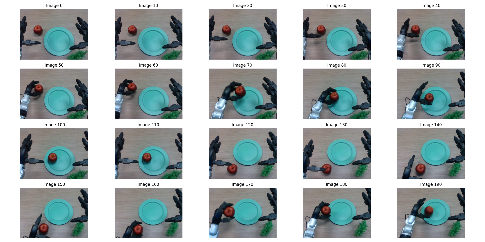
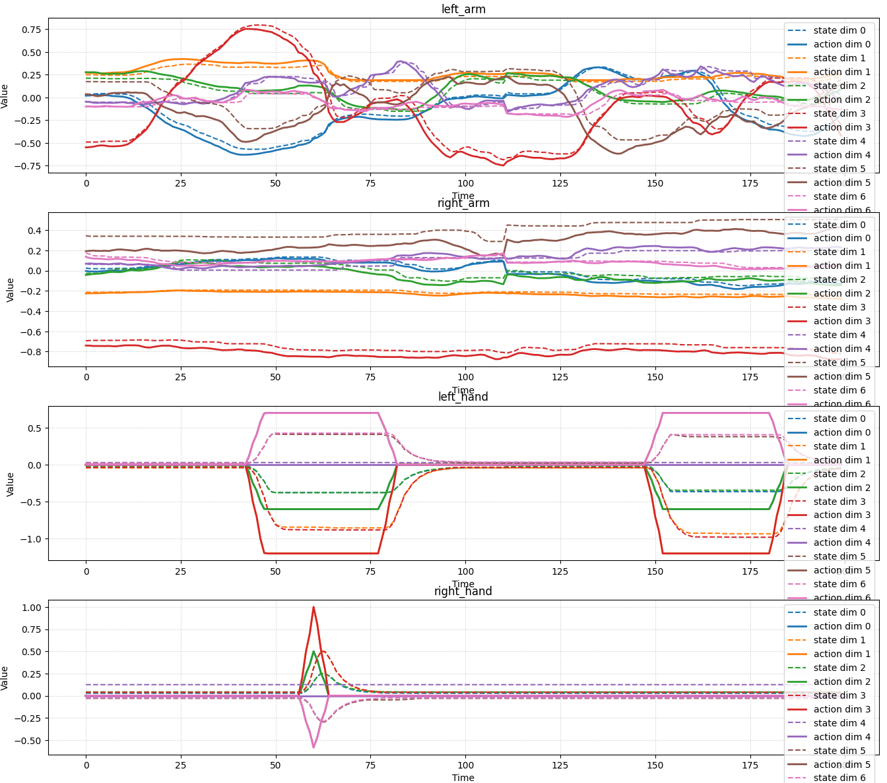
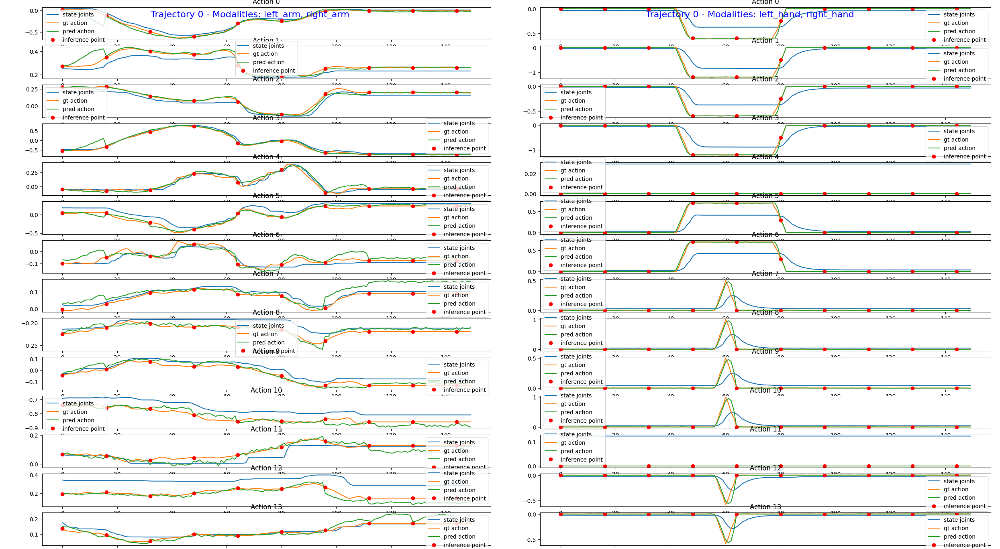

# New Embodiment Finetuning Tutorial

This notebook is a tutorial on how to finetune GR00T-N1 pretrained model on a new dataset. 

# Lerobot So100/So101 Finetuning Tutorial

GR00T-N1.5 is accessible to everyone with various robot form-factors. Based on Huggingface's low-cost [So101 Lerobot arm](https://huggingface.co/docs/lerobot/so101), users can finetune GR00T-N1.5 on their own robot via a `new_embodiment` tag.

| So100 Strawberry and Grape Picking | So101 Table Cleanup Task |
|----------------------|---------------------|
| {width=400} | {width=400} |


| Dataset | Observation | Viz Link |
|---------|------------|------|
| so101-table-cleanup | Dual camera views of table cleanup task | [Link](https://huggingface.co/spaces/lerobot/visualize_dataset?dataset=youliangtan%2Fso101-table-cleanup) |
| so100_strawberry_grape | Single camera view of strawberry and grape picking | [Link](https://huggingface.co/spaces/lerobot/visualize_dataset?dataset=youliangtan%2Fso100_strawberry_grape&episode=0) |
| tictac-bot | Single camera view of a tic-tac-toe board | [Link](https://huggingface.co/datasets/youliangtan/tictac-bot) |

## Step 1: Dataset

Users can use any lerobot dataset for finetuning. In this tutorial, we will first use a sample dataset: [so101-table-cleanup](https://huggingface.co/spaces/lerobot/visualize_dataset?dataset=youliangtan%2Fso101-table-cleanup&episode=0)

Note that this embodiment was not used in our pretraining dataset mixture.


### First, download the dataset

```bash
huggingface-cli download \
    --repo-type dataset youliangtan/so101-table-cleanup \
    --local-dir ./demo_data/so101-table-cleanup
```

### Second, copy over the modality file

The `modality.json` file provides additional information about the state and action modalities to make it "GR00T-compatible". Copy over the `examples/so100_dualcam__modality.json` to the dataset `<DATASET_PATH>/meta/modality.json`.


For Dual Camera setup like [so101-table-cleanup](https://huggingface.co/datasets/youliangtan/so101-table-cleanup) dataset, do:
```bash
cp examples/so100_dualcam__modality.json ./demo_data/so101-table-cleanup/meta/modality.json
```

For Single Camera setup like [so100_strawberry_grape](https://huggingface.co/spaces/lerobot/visualize_dataset?dataset=youliangtan%2Fso100_strawberry_grape&episode=0) dataset, do:
```bash
cp examples/so100__modality.json ./demo_data/so100_strawberry_grape/meta/modality.json
```

Then we can load the dataset using the `LeRobotSingleDataset` class.


## Step 2: Finetuning

Finetuning can be done by using our finetuning `scripts/gr00t_finetune.py`, as a "new-embodiment" tag is supported.

```bash
python scripts/gr00t_finetune.py \
   --dataset-path /datasets/so101-table-cleanup/ \
   --num-gpus 1 \
   --batch-size 64 \
   --output-dir ~/so101-checkpoints  \
   --max-steps 10000 \
   --data-config so100_dualcam
```

> adjust the batch size to your GPU memory.

## Step 3: Open-loop evaluation

Once the training is done, you can run the following command to visualize the finetuned policy. 

```bash
python scripts/eval_policy.py --plot \
   --embodiment_tag new_embodiment \
   --model_path <YOUR_CHECKPOINT_PATH> \
   --data_config so100_dualcam \
  --dataset_path /datasets/so101-table-cleanup/ \
   --modality_keys single_arm gripper
```

This is a plot after training the policy for 7k steps.


After training for more steps the plot will look significantly better.

TADA! You have successfully finetuned GR00T-N1.5 on a new embodiment.

## Step 4: Deployment

First, make sure the data is replay-able, refer to the lerobot doc: https://huggingface.co/docs/lerobot/so101

Evaluate the policy on the robot:
```bash
python eval_lerobot.py \
    --robot.type=so101_follower \
    --robot.port=/dev/ttyACM0 \
    --robot.id=lil_guy \
    --robot.cameras="{ wrist: {type: opencv, index_or_path: 9, width: 640, height: 480, fps: 30}, front: {type: opencv, index_or_path: 15, width: 640, height: 480, fps: 30}}" \
    --policy_host=10.112.209.136 \
    --lang_instruction="Grab pens and place into pen holder."
```

For more details about deployment, please refer to the notebook: `5_policy_deployment.md`

---

# Unitree G1 Finetuning

This section shows how to finetune on a Unitree G1 robot as a new embodiment. Dataset is available at: [nvidia/PhysicalAI-Robotics-GR00T-Teleop-G1](https://huggingface.co/datasets/nvidia/PhysicalAI-Robotics-GR00T-Teleop-G1)

**Specifications**:
- Observation: 43 dim of vectorized state (joint positions of full body + hands)
- Action: 43 dim of vectorized action (joint positions of full body + hands)
- Video: RGB video, 640x480 resolution, 20fps
- Language Instruction:
  - "Pick the apple from the table and place it into the basket."
  - "Pick the pear from the table and place it into the basket."
  - "Pick the grapes from the table and place them into the basket."
  - "Pick the starfruit from the table and place it into the basket."

## Step 1: Download the dataset

```bash
huggingface-cli download \
    --repo-type dataset nvidia/PhysicalAI-Robotics-GR00T-Teleop-G1 \
    --local-dir ./datasets/
```

## Step 2: Try loading the dataset and visualize it

Example: load the first episode of the apple dataset
```bash
python scripts/load_dataset.py --dataset-path datasets/PhysicalAI-Robotics-GR00T-Teleop-G1/g1-pick-apple/ --plot-state-action

### Similar for other fruits
# Switch to other fruits -- pear, grapes, starfruit
```

You should see the following plots:
<div style="display: flex; justify-content: space-between;">
    
    
</div>


## Step 3: Finetuning

Here we can provide a list of datasets to finetune on. We will finetune the model with all the datasets which have a mix of `apple`, `pear`, `grapes`, `starfruit` picking tasks.

```bash
dataset_list=(
    "datasets/PhysicalAI-Robotics-GR00T-Teleop-G1/g1-pick-apple/"
    "datasets/PhysicalAI-Robotics-GR00T-Teleop-G1/g1-pick-pear/"
    "datasets/PhysicalAI-Robotics-GR00T-Teleop-G1/g1-pick-grapes/"
    "datasets/PhysicalAI-Robotics-GR00T-Teleop-G1/g1-pick-starfruit/"
)

python scripts/gr00t_finetune.py \
    --dataset-path ${dataset_list[@]} \
    --num-gpus 1 --batch-size 95  --output-dir ~/checkpoints/full-g1-mix-fruits/  \
    --data-config unitree_g1 --max-steps 15000
```

> NOTE: Since the dataset is recorded with h264 codec, we need to use the `decord` backend for video loading.

## Step 4: Open-loop evaluation

Example: evaluate the apple dataset

```bash
python scripts/eval_policy.py --plot \
   --embodiment_tag new_embodiment \
   --model_path <YOUR_CHECKPOINT_PATH> \
   --data_config unitree_g1 \
   --dataset_path datasets/PhysicalAI-Robotics-GR00T-Teleop-G1/g1-pick-apple/ \
   --video_backend decord \
   --modality_keys left_arm right_arm
```




We can see that the policy's prediction of the action seems to be close to the ground truth, which indicates that the finetuning is successful. However for actual performance of the policy, we need to evaluate it on the real robot.

## Step 5: Deployment

The deployment script for G1 is not provided here. But this pipeline is similar to the so100 finetuning pipeline.
