<div align="center">
  <h1 align="center"> unitree_sim_isaaclab </h1>
  <h3 align="center"> Unitree Robotics </h3>
  <p align="center">
    <a> English </a> | <a href="README_zh-CN.md">中文</a> 
  </p>
  <a href="https://discord.gg/ZwcVwxv5rq" target="_blank"></a>
</div>

## Important Notes First
- Please use the [officially recommended](https://isaac-sim.github.io/IsaacLab/main/source/setup/installation/index.html) hardware resources for deployment
- The simulator may take some time to load resources during its first startup, and the waiting time depends on hardware performance and network environment
- After the simulator starts running, it will send/receive the same DDS topics as the real robot (Please note to distinguish between the simulator and real robot if there is a real robot running on the same network). For specific DDS usage, please refer to[G1 Control](https://github.com/unitreerobotics/unitree_sdk2_python/tree/master/example/g1) and [Dex3 Dexterous Hand Control](https://github.com/unitreerobotics/unitree_sdk2/blob/main/example/g1/dex3/g1_dex3_example.cpp)
- The weight files provided in this project are only for simulation environment testing
- Currently, our project has only been tested on RTX 3080, RTX 3090, and RTX 4090 GPUs. For the RTX 50 series GPUs, please use Isaac Sim version 5.0.0
- After the virtual scene starts up, please click PerspectiveCamera -> Cameras -> PerspectiveCamera to view the main view scene. The operation steps are shown below:
<table align="center">
    <tr>
    <td align="center">
        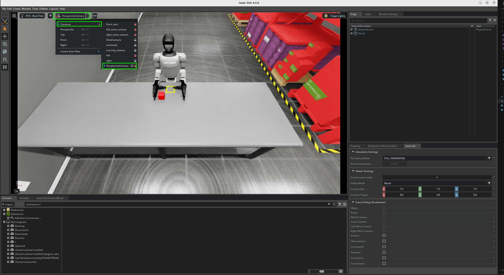
      <br/>
      <code>Main View Finding Steps</code>
    </td>
    </tr>
</table>

## 1、 📖 Introduction

This project is built on **Isaac Lab** to simulate **Unitree robots** in various tasks, facilitating data collection, playback, generation, and model validation. It can be used in conjunction with the [xr_teleoperate](https://github.com/unitreerobotics/xr_teleoperate) repository for dataset collection. The project adopts the same DDS communication protocol as the real robot to enhance code generality and ease of use.

Currently, the project employs Unitree G1/H1-2 robots equipped with different actuators, and provides simulation scenarios for multiple tasks. The task names and corresponding illustrations are summarized in the table below. Tasks that include `Wholebody` in their names enable mobile operations.

<table align="center">
  <tr>
    <th>G1-29dof-gripper</th>
    <th>G1-29dof-dex3</th>
    <th>G1-29dof-inspire</th>
    <th>H1-2-inspire</th>
  </tr>
  <tr>
    <td align="center">
      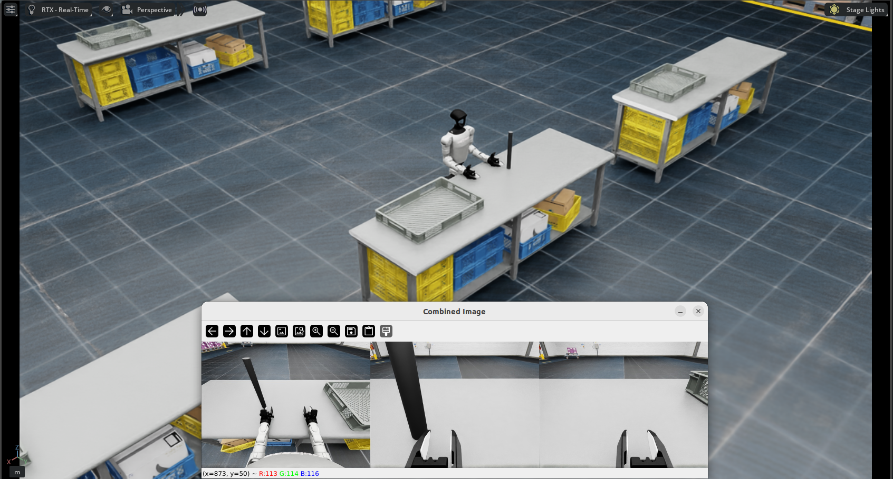
      <br/>
      <code>Isaac-PickPlace-Cylinder-G129-Dex1-Joint</code>
    </td>
    <td align="center">
      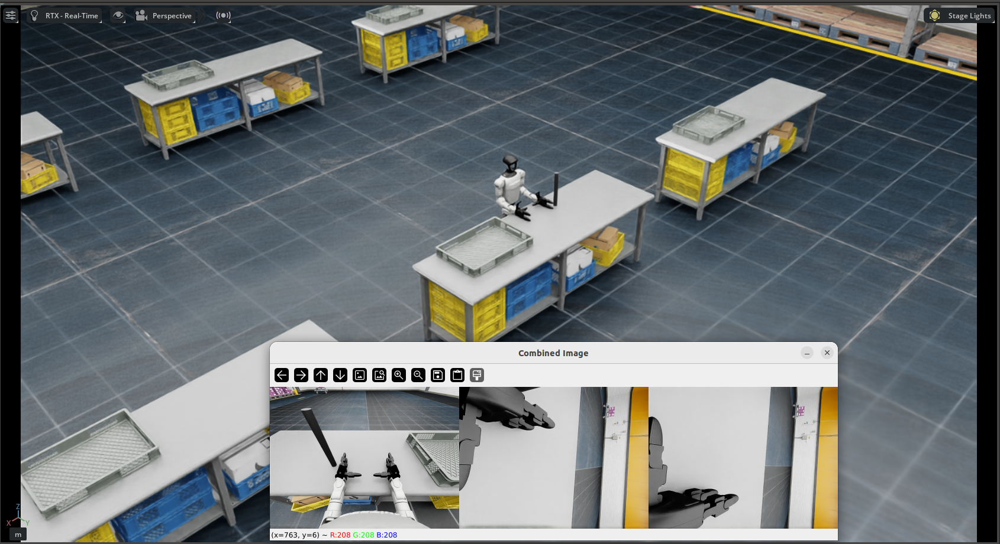
      <br/>
      <code>Isaac-PickPlace-Cylinder-G129-Dex3-Joint</code>
    </td>
    <td align="center">
      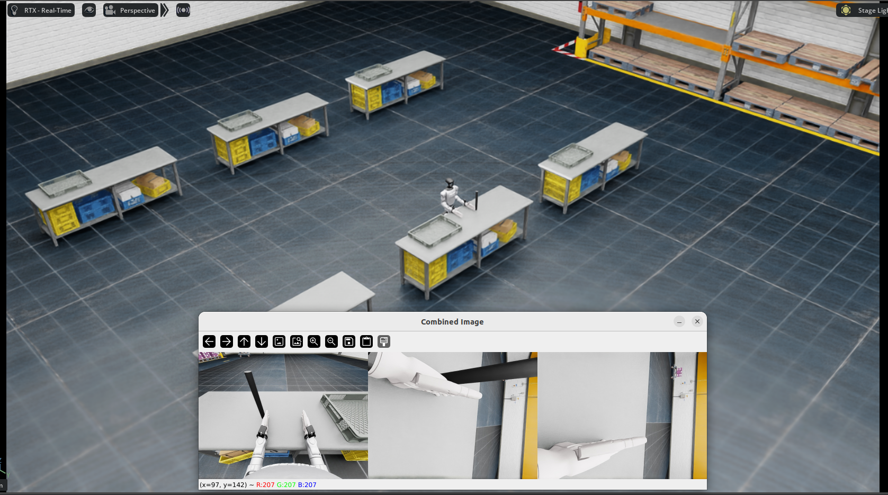
      <br/>
      <code>Isaac-PickPlace-Cylinder-G129-Inspire-Joint</code>
    </td>
    <td align="center">
      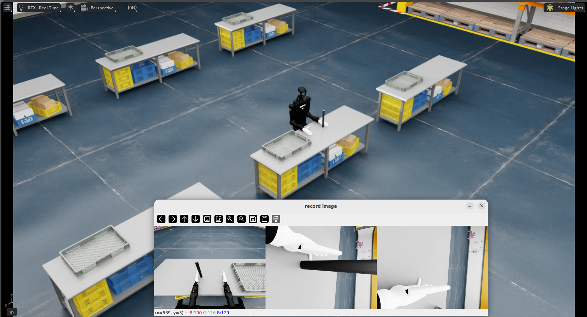
      <br/>
      <code>Isaac-PickPlace-Cylinder-H12-27dof-Inspire-Joint</code>
    </td>
  </tr>
  <tr>
    <td align="center">
      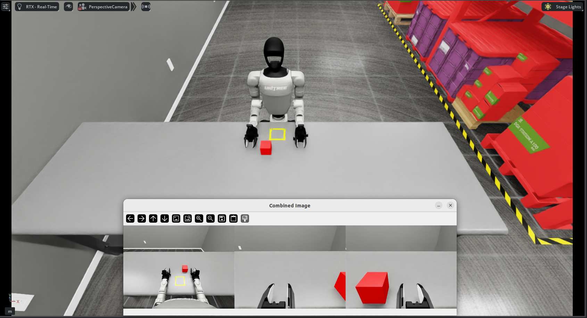
      <br/>
      <code>Isaac-PickPlace-RedBlock-G129-Dex1-Joint</code>
    </td>
    <td align="center">
      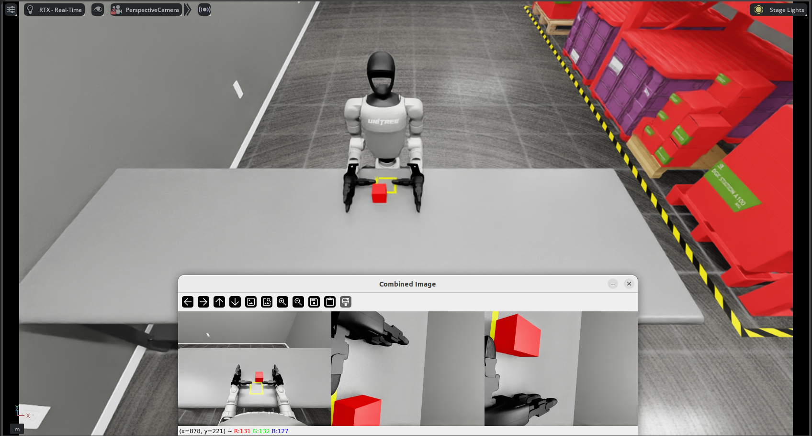
      <br/>
      <code>Isaac-PickPlace-RedBlock-G129-Dex3-Joint</code>
    </td>
    <td align="center">
      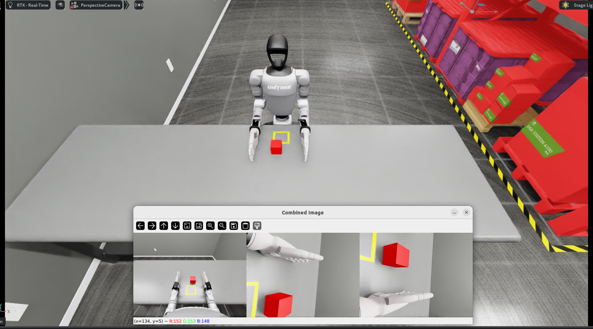
      <br/>
      <code>Isaac-PickPlace-RedBlock-G129-Inspire-Joint</code>
    </td>
    <td align="center">
      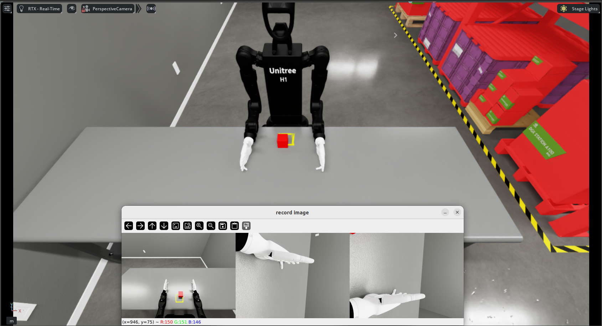
      <br/>
      <code>Isaac-PickPlace-RedBlock-H12-27dof-Inspire-Joint</code>
    </td>
  </tr>
  <tr>
    <td align="center">
      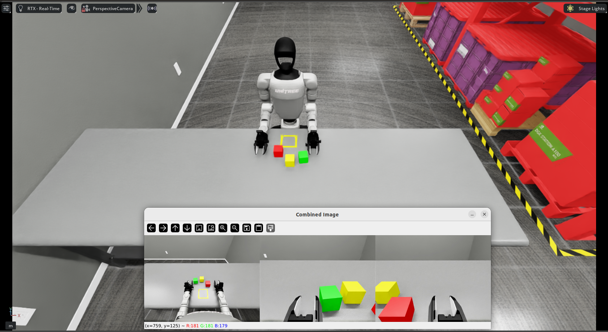
      <br/>
      <code>Isaac-Stack-RgyBlock-G129-Dex1-Joint</code>
    </td>
    <td align="center">
      
      <br/>
      <code>Isaac-Stack-RgyBlock-G129-Dex3-Joint</code>
    </td>
    <td align="center">
      
      <br/>
      <code>Isaac-Stack-RgyBlock-G129-Inspire-Joint</code>
    </td>
    <td align="center">
      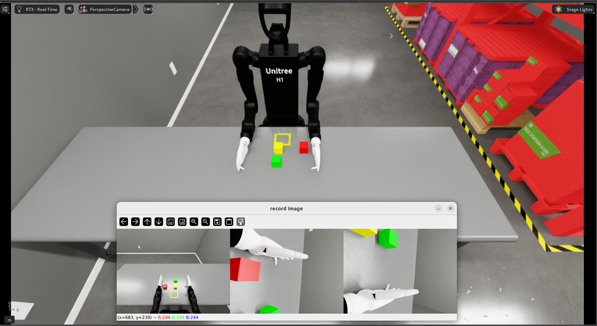
      <br/>
      <code> Isaac-Stack-RgyBlock-H12-27dof-Inspire-Joint</code>
    </td>
  </tr>
    <tr>
    <td align="center">
      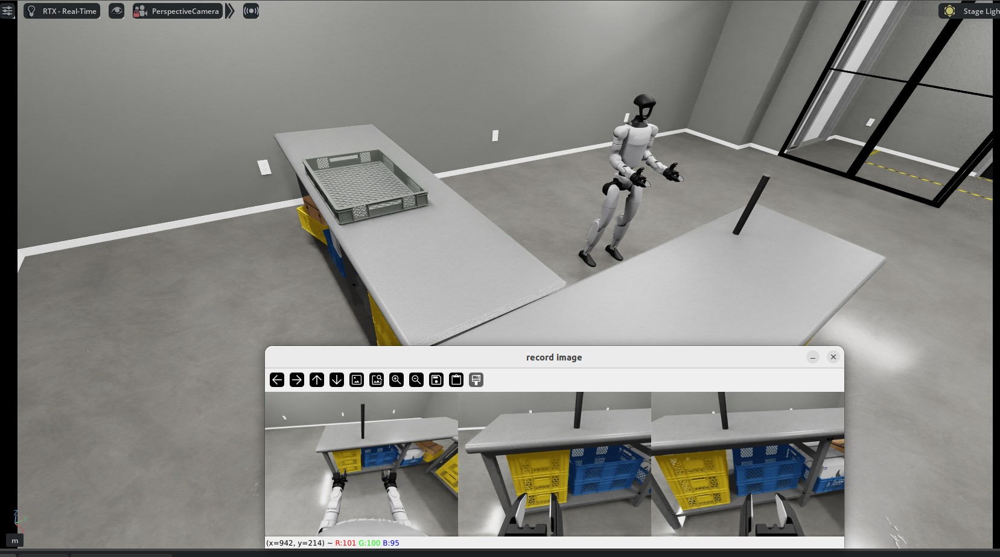
      <br/>
      <code>Isaac-Move-Cylinder-G129-Dex1-Wholebody</code>
    </td>
    <td align="center">
      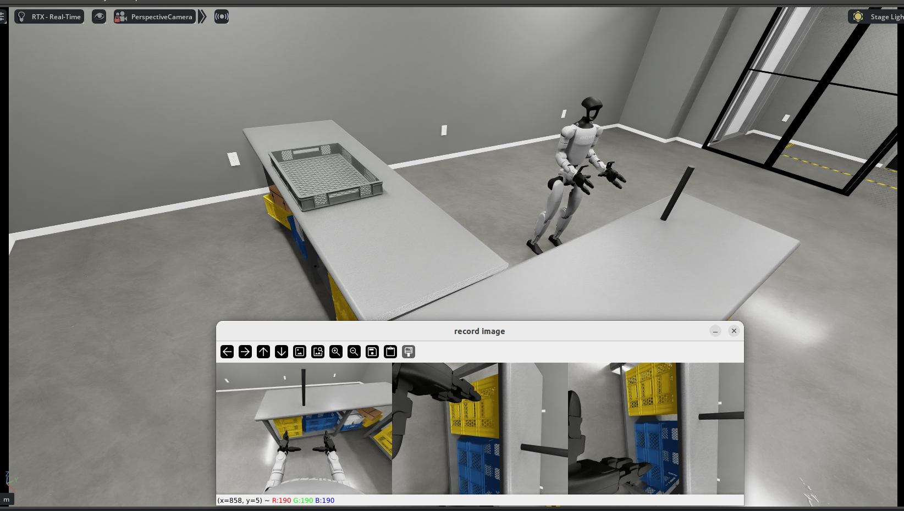
      <br/>
      <code>Isaac-Move-Cylinder-G129-Dex3-Wholebody</code>
    </td>
    <td align="center">
      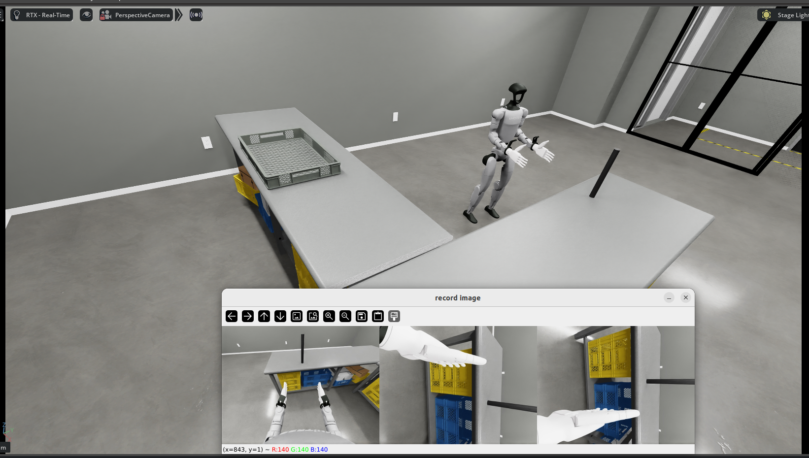
      <br/>
      <code>Isaac-Move-Cylinder-G129-Inspire-Wholebody</code>
    </td>
  </tr>
</table>

## 2、⚙️ Environment Setup and Running

This project requires Isaac Sim 4.5.0/Isaac Sim 5.0.0 and Isaac Lab. You can refer to the [official installation guide](https://isaac-sim.github.io/IsaacLab/main/source/setup/installation/pip_installation.html)  or follow the steps below. The installation methods for Ubuntu 20.04 and Ubuntu 22.04 (and later versions) are different. Please choose the installation method based on your system version and GPU resources.

### 2.1 Isaac Sim 4.5.0 Environment Installation (Recommended for RTX 4080 and below)

Please refer to the <a href="doc/isaacsim4.5_install.md">Isaac Sim 4.5.0 Environment Installation Steps</a> for the setup.

### 2.2 Isaac Sim 5.0.0 Environment Installation (Recommended for RTX 4080 and above)

Please refer to the <a href="doc/isaacsim5.0_install.md">Isaac Sim 5.0.0 Environment Installation Steps</a> for the setup.

### 2.3 Build the Docker Environment (Using Ubuntu 22.04 / IsaacSim 5.0)

#### 2.3.1 Build the Docker environment
```shell
sudo docker pull nvidia/cuda:12.2.0-runtime-ubuntu22.04
cd unitree_sim_isaaclab
sudo docker build \
  --build-arg http_proxy=http://127.0.0.1:7890 \
  --build-arg https_proxy=http://127.0.0.1:7890 \
  -t unitree-sim:latest -f Dockerfile .

# If you need to use a proxy, please fill in
# --build-arg http_proxy=http://127.0.0.1:7890 --build-arg https_proxy=http://127.0.0.1:7890
```

#### 2.3.2 Enter the Docker environment

```shell
xhost +local:docker

sudo docker run --gpus all -it --rm   --network host   -e NVIDIA_VISIBLE_DEVICES=all   -e NVIDIA_DRIVER_CAPABILITIES=compute,utility,video,graphics,display   -e LD_LIBRARY_PATH=/usr/local/nvidia/lib:/usr/local/nvidia/lib64:$LD_LIBRARY_PATH   -e DISPLAY=$DISPLAY   -e VK_ICD_FILENAMES=/etc/vulkan/icd.d/nvidia_icd.json   -v /etc/vulkan/icd.d:/etc/vulkan/icd.d:ro   -v /usr/share/vulkan/icd.d:/usr/share/vulkan/icd.d:ro   -v /tmp/.X11-unix:/tmp/.X11-unix:rw   -v /home/unitree/newDisk/unitree_sim_isaaclab_usds:/home/code/isaacsim_assets   unitree-sim /bin/bash

# The option `-v /home/unitree/newDisk/unitree_sim_isaaclab_usds:/home/code/isaacsim_assets` maps the `unitree_sim_isaaclab_usds` directory on the host machine to `isaacsim_assets` inside the Docker container, making it convenient to share data between the host and the container. Please modify it according to your own setup.
```

### 2.4 Run Program

#### 2.4.1 Asset Download

Use the following command to download the required asset files

```
sudo apt update

sudo apt install git-lfs

. fetch_assets.sh
```

#### 2.4.2 Teleoperation

```
python sim_main.py --device cpu  --enable_cameras  --task  Isaac-PickPlace-Cylinder-G129-Dex1-Joint    --enable_dex1_dds --robot_type g129
```

- --task: Task name, corresponding to the task names in the table above
- --enable_dex1_dds/--enable_dex3_dds: Represent enabling DDS for two-finger gripper/three-finger dexterous hand respectively  
- --robot_type: Robot type, currently has 29-DOF unitree g1 (g129),27-DoF H1-2
- --headless: This allows running without launching the simulation window. Add this parameter if you're using a Docker environment.

**Note:** If you need to control robot movement, please refer to `send_commands_8bit.py` or `send_commands_keyboard.py` to publish control commands, or you can use them directly. Please note that only tasks marked with `Wholebody` are mobile tasks and can control the robot's movement.

#### 2.4.3 Data Replay

```
python sim_main.py --device cpu  --enable_cameras  --task Isaac-Stack-RgyBlock-G129-Dex1-Joint     --enable_dex1_dds --robot_type g129 --replay  --file_path "/home/unitree/Code/xr_teleoperate/teleop/utils/data" 
```
- --replay: Specifies whether to perform data replay.

- --file_path: Directory where the dataset is stored (please update this to your own dataset path).


**Note:** The dataset format used here is consistent with the one recorded via teleoperation in [xr_teleoperate](https://github.com/unitreerobotics/xr_teleoperate) .

**Note:** For task-discrete rewards, you can use the `get_step_reward_value` function to retrieve them.


#### 2.4.4 Data Generation
During data replay, by modifying lighting conditions and camera parameters and re-capturing image data, more diverse visual features can be generated for data augmentation, thereby improving the model’s generalization ability.
```
python sim_main.py --device cpu  --enable_cameras  --task Isaac-Stack-RgyBlock-G129-Dex1-Joint     --enable_dex1_dds --robot_type g129 --replay  --file_path "/home/unitree/Code/xr_teleoperate/teleop/utils/data" --generate_data --generate_data_dir "./data2"
```

- --generate_data: Enables generation of new data.

- --generate_data_dir: Directory to store the newly generated data.

- --rerun_log: Enables logging during data generation.

- --modify_light: Enables modification of lighting conditions (you need to adjust the update_light function in main accordingly).

- --modify_camera: Enables modification of camera parameters (you need to adjust the batch_augment_cameras_by_name function in main accordingly).

**Note:**
If you wish to modify lighting or camera parameters, please tune and test the parameters carefully before performing large-scale data generation.

## 3、Task Scene Construction

### 3.1 Code Structure

```
unitree_sim_isaaclab/
│
├── action_provider                   [Action providers, provides interfaces for reading file actions, receiving DDS actions, policy-generated actions, etc. Currently mainly uses DDS-based action acquisition]
│
├── dds                               [DDS communication module, implements DDS communication for g1, gripper, and three-finger dexterous hand]
│
├── image_server                      [Image publishing service, uses ZMQ for image publishing]
│
├── layeredcontrol                    [Low-level control module, gets actions and sets them in virtual environment]
│
├── robots                            [Basic robot configurations]
│
├── tasks                             [Task-related files]
│   ├── common_config
│   │     ├── camera_configs.py       [Camera placement related configurations]
│   │     ├── robot_configs.py        [Robot setup related configurations]
│   │
│   ├── common_event
│   │      ├── event_manager.py       [Event registration management]  
│   │
│   ├── common_observations
│   │      ├── camera_state.py        [Camera data acquisition]  
│   │      ├── dex3_state.py          [Three-finger dexterous hand data acquisition]
│   │      ├── g1_29dof_state.py      [Robot state data acquisition]
│   │      ├── gripper_state.py       [Gripper data acquisition]
│   │
│   ├── common_scene                
│   │      ├── base_scene_pickplace_cylindercfg.py         [Common scene for cylinder grasping task]  
│   │      ├── base_scene_pickplace_redblock.py            [Common scene for red block grasping task] 
│   │
│   ├── common_termination                                 [Judgment of whether objects in different tasks exceed specified working range]
│   │      ├── base_termination_pick_place_cylinder         
│   │      ├── base_termination_pick_place_redblock 
│   │
│   ├── g1_tasks                                            [All g1-related tasks]
│   │      ├── pick_place_cylinder_g1_29dof_dex1            [Cylinder grasping task]
│   │      │     ├── mdp                                      
│   │      │     │     ├── observations.py                  [Observation data]
│   │      │     │     ├── terminations.py                  [Termination judgment conditions]
│   │      │     ├── __init__.py                            [Task name registration]  
│   │      │     ├── pickplace_cylinder_g1_29dof_dex1_joint_env_cfg.py           [Task-specific scene import and related class initialization]
│   │      ├── ...
│   │      ├── __init__.py                                  [Display all task names existing in g1]
│   ├── utils                                               [Utility functions]
├── tools                                                   [USD conversion and modification related tools]
├── usd                                                     [USD model files]
├── sim_main.py                                             [Main function] 
├── reset_pose_test.py                                      [Test function for object position reset] 
```

### 3.2 Task Scene Construction Steps
If using existing robot configurations (G1-29dof-gripper, G1-29dof-dex3) to build new task scenes, just follow the steps below:

#### 3.2.1、Build Common Parts of Task Scene (i.e., scenes other than the robot)
According to existing task configurations, add new task common scene configurations in the common_scene directory. You can refer to existing task common configuration files.
#### 3.2.2 Termination or Object Reset Condition Judgment
Add termination or object reset judgment conditions according to your scene needs in the common_termination directory
#### 3.2.3 Add and Register Tasks
Add new task directories in the g1_tasks directory and modify related files following existing tasks. Taking the pick_place_cylinder_g1_29dof_dex1 task as an example:

- observations.py: Add corresponding observation functions, just import the corresponding files as needed
 ```

# Copyright (c) 2025, Unitree Robotics Co., Ltd. All Rights Reserved.
# License: Apache License, Version 2.0  
from tasks.common_observations.g1_29dof_state import get_robot_boy_joint_states
from tasks.common_observations.gripper_state import get_robot_gipper_joint_states
from tasks.common_observations.camera_state import get_camera_image

# ensure functions can be accessed by external modules
__all__ = [
    "get_robot_boy_joint_states",
    "get_robot_gipper_joint_states", 
    "get_camera_image"
]

 ```
- terminations.py: Add corresponding condition judgment functions, import corresponding files from common_termination
 ```
 from tasks.common_termination.base_termination_pick_place_cylinder import reset_object_estimate
__all__ = [
"reset_object_estimate"
]
 ```

- pick_place_cylinder_g1_29dof_dex1/```__init__.py ```

Add ```__init__.py``` in the new task directory and add task name, as shown in the ```__init__.py``` under pick_place_cylinder_g1_29dof_dex1:

```
# Copyright (c) 2025, Unitree Robotics Co., Ltd. All Rights Reserved.
# License: Apache License, Version 2.0  

import gymnasium as gym

from . import pickplace_cylinder_g1_29dof_dex1_joint_env_cfg


gym.register(
    id="Isaac-PickPlace-Cylinder-G129-Dex1-Joint",
    entry_point="isaaclab.envs:ManagerBasedRLEnv",
    kwargs={
        "env_cfg_entry_point": pickplace_cylinder_g1_29dof_dex1_joint_env_cfg.PickPlaceG129DEX1BaseFixEnvCfg,
    },
    disable_env_checker=True,
)


```
- Write the environment configuration file corresponding to the task, such as pickplace_cylinder_g1_29dof_dex1_joint_env_cfg.py

Import common scenes, set robot positions, and add camera configurations

- Modify g1_tasks/```__init__.py```

Add the new task configuration class to the ```__init__.py``` file in the g1_tasks directory as follows:

```

# Copyright (c) 2025, Unitree Robotics Co., Ltd. All Rights Reserved.
# License: Apache License, Version 2.0  
"""Unitree G1 robot task module
contains various task implementations for the G1 robot, such as pick and place, motion control, etc.
"""

# use relative import
from . import pick_place_cylinder_g1_29dof_dex3
from . import pick_place_cylinder_g1_29dof_dex1
from . import pick_place_redblock_g1_29dof_dex1
from . import pick_place_redblock_g1_29dof_dex3
# export all modules
__all__ = ["pick_place_cylinder_g1_29dof_dex3", "pick_place_cylinder_g1_29dof_dex1", "pick_place_redblock_g1_29dof_dex1", "pick_place_redblock_g1_29dof_dex3"]

```
### 📋 TODO List

- ⬜ Continue adding new task scenes
- ⬜ Continue code optimization 

## 🙏 Acknowledgement

This code builds upon following open-source code-bases. Please visit the URLs to see the respective LICENSES:

1. https://github.com/isaac-sim/IsaacLab
2. https://github.com/isaac-sim/IsaacSim
3. https://github.com/zeromq/pyzmq
4. https://github.com/unitreerobotics/unitree_sdk2_python